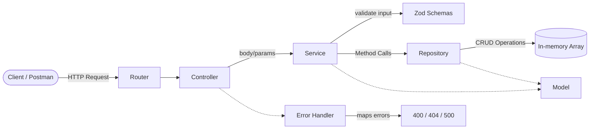

# Lab Work 1

## Topic

Building a monolithic CRUD backend using layered architecture.

## Goal

- Understand layered architecture principles.
- Separate responsibilities across application layers.
- Implement a simple REST API.
- Practice team workflow with GitHub branches and pull requests.

## Project Overview

[GitHub Repository: 2-course-kpi](https://github.com/AnnKuts/2-course-kpi/tree/main)

This project is a **monolithic backend application** that provides a REST API for managing a collection of books.

Supported CRUD operations:

- Create a book
- Read all books
- Read book by ID
- Update a book
- Delete a book

Data is stored in an **in-memory array**, not in a database.

## Project Structure

```text
src/
 ├── controllers/      # HTTP layer (book.controller.ts)
 ├── services/         # Business logic + validation (book.service.ts)
 ├── repos/            # Data access layer (book.repository.ts)
 ├── models/           # Domain entity contracts (book.model.ts)
 ├── schemas/          # Zod schemas and DTO types (book.schema.ts)
 ├── utils/            # Shared helpers (error handlers, custom errors)
 ├── routes/           # Route registration (book.router.ts)
 ├── server.ts         # Express app setup
 └── main.ts           # Application entry point
```

## Architecture

The application follows this layered flow:

`Controller -> Service -> Repository -> Model`

### Architecture Diagram (Mermaid)



### Layer Responsibilities

1. **Controller**
   - Accepts HTTP requests.
   - Validates simple route params (for example, numeric ID).
   - Calls service methods.
   - Returns HTTP responses.

2. **Service**
   - Contains business logic.
   - Performs request body validation via Zod.
   - Throws domain-specific errors (`NotFoundError`, validation errors).
   - Calls repository methods.

3. **Repository**
   - Works with data storage (in-memory array).
   - Implements CRUD data operations.
   - Returns plain model objects.

4. **Model**
   - Defines the `Book` entity shape used across layers.

### Validation and Error Flow

- Zod schemas are defined in `src/schemas/book.schema.ts`.
- Validation is executed in the service layer (`createBookSchema.parse(...)`).
- Validation errors are mapped to `400 Bad Request`.
- Not-found conditions are represented with `NotFoundError` and mapped to `404 Not Found`.
- Unexpected errors are mapped to `500 Internal Server Error`.

## Domain Model

Main entity: **Book**

Fields:

- `id`: unique numeric identifier
- `title`: book title
- `author`: author name
- `genre`: one of allowed genres
- `rating`: numeric rating from 0 to 5
- `description`: text description
- `isRead`: read status (`true`/`false`)

Allowed `genre` values:

- Fiction
- Fantasy
- Science
- Romance
- Horror

## Zod Validation Rules

`createBookSchema` validates incoming book payloads:

- `title`: required non-empty string
- `author`: required non-empty string
- `genre`: enum (`Fiction | Fantasy | Science | Romance | Horror`)
- `rating`: number between `0` and `5`
- `description`: string
- `isRead`: boolean

For updates, partial validation is used (`createBookSchema.partial()`), so only provided fields are validated.

## API Endpoints

- `GET /api/books` - Get all books
- `GET /api/books/:id` - Get a book by ID
- `POST /api/books` - Create a new book
- `PUT /api/books/:id` - Update a book
- `DELETE /api/books/:id` - Delete a book

### Example request body (`POST /api/books`)

```json
{
  "title": "Clean Code",
  "author": "Robert C. Martin",
  "genre": "Science",
  "rating": 5,
  "description": "A book about software craftsmanship.",
  "isRead": true
}
```

## HTTP Status Codes

- `200 OK`: successful read/update request
- `201 Created`: resource created
- `204 No Content`: successful delete request
- `400 Bad Request`: invalid input data
- `404 Not Found`: resource not found
- `500 Internal Server Error`: unexpected server error

## Testing

You can test the API using:

- Postman
- curl

## Technologies

- Node.js
- Express.js
- TypeScript
- Zod
- ESLint / Prettier
- In-memory storage (array)

## Team Workflow

- Each team member works in a separate branch.
- Changes are pushed to feature branches.
- Pull requests are created into the base lab branch.
- Code is reviewed before merge.
