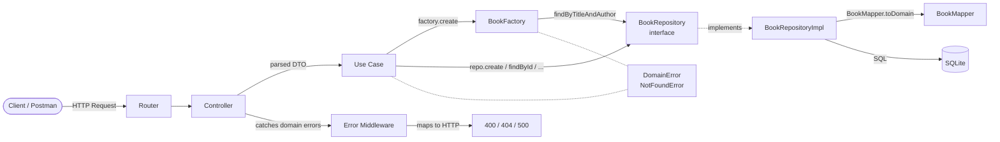

# Lab Work 2

## Topic

Layered architecture and domain model.

## Goal

- Separate business logic from infrastructure.
- Apply Domain-Driven Design tactical patterns: Domain Factory, Repository Pattern, Domain Errors.
- Implement a clean four-layer architecture.
- Cover the domain and application layers with unit tests, and the full stack with integration tests.

## Project Overview

[PR of refactoring Lab1 and implementation Lab2](https://github.com/AnnKuts/2-course-kpi/tree/lab2)

This project is a refactored version of Lab 1. The same book management REST API is rebuilt using a strict four-layer architecture where business logic is fully isolated from infrastructure and transport concerns.

## Project Structure

```text
src/
 ├── domain/
 │    ├── models/          # Domain entity: Book.ts, Genre.ts
 │    ├── errors/          # DomainError.ts, NotFoundError.ts
 │    ├── factories/       # BookFactory.ts (invariant validation)
 │    └── repositories/    # BookRepository interface (port)
 ├── application/
 │    └── use-cases/       # BookUseCases.ts (orchestration)
 ├── infrastructure/
 │    ├── database/        # SQLite setup: database.ts
 │    ├── entities/        # ORM/DB interface: book.entity.ts
 │    ├── mappers/         # BookMapper.ts (domain ↔ entity)
 │    └── repositories/    # BookRepositoryImpl.ts (adapter)
 ├── presentation/
 │    └── controllers/     # BookController.ts (HTTP layer)
 ├── routes/               # Router registration
 ├── schemas/              # Zod validation schemas
 ├── middlewares/          # Error middleware
 ├── utils/                # catchAsync, errorHandler
 ├── server.ts             # Composition root
 └── main.ts               # Entry point
```

## Architecture

The application follows the Layered Architecture described by Eric Evans in *Domain-Driven Design* (2003):

```
Presentation → Application → Domain ← Infrastructure
```

### Architecture Diagram (Mermaid)



### Layer Responsibilities

1. **Domain**
   - Contains `Book` entity, `Genre` enum, domain errors.
   - `BookFactory` validates invariants (simple + complex via repository interface).
   - `BookRepository` interface defines the contract — lives in domain, implemented in infrastructure (DIP).
   - No dependencies on ORM, HTTP, or any framework.

2. **Application**
   - `BookUseCases.ts` — one use case class per operation.
   - Orchestrates domain factory and repository.
   - Validates update invariants (Anemic model approach: title/author non-empty).
   - Depends only on domain interfaces.

3. **Infrastructure**
   - `BookRepositoryImpl` — implements `BookRepository` using SQLite.
   - `BookMapper` — maps between `Book` (domain) and `BookEntity` (DB row).
   - `database.ts` — SQLite connection setup with optional filename (`:memory:` for tests).

4. **Presentation**
   - `BookController` — parses HTTP requests, calls use cases, returns responses.
   - Zod schemas validate input format before it reaches the domain.
   - `errorMiddleware` maps domain errors to HTTP status codes.

## Domain Model

Main entity: **Book**

Fields:

- `id`: unique numeric identifier
- `title`: book title (non-empty)
- `author`: author name (non-empty)
- `genre`: one of `Genre` enum values
- `rating`: numeric rating from 1 to 5 (enforced by setter)
- `description`: text description
- `isRead`: read status (`true`/`false`)

Behavior:

- `markAsRead()` — sets `isRead = true`
- `rating` setter — throws `DomainError` if value is outside `[1, 5]`

## Domain Factory

`BookFactory` validates all invariants on creation:

| Check | Type |
|-------|------|
| `title` is not empty | Simple (no DB) |
| `author` is not empty | Simple (no DB) |
| `rating` in `[1, 5]` | Simple (via `Book` setter) |
| No duplicate `title + author` | Complex (via `BookRepository` interface) |

The factory receives `BookRepository` through its constructor — this is **Dependency Inversion**: the domain defines the interface, infrastructure provides the implementation.

## Domain Errors

```
DomainError (base)
└── NotFoundError
```

- Domain throws `DomainError` or `NotFoundError`.
- Presentation layer maps them to HTTP status codes:
  - `NotFoundError` → `404 Not Found`
  - `DomainError` → `400 Bad Request`
  - Zod errors → `400 Bad Request`
  - Everything else → `500 Internal Server Error`

## ADR: Domain Model Approach

See [ADR 001](decisions/domain-model.md).

**Decision**: Anemic Domain Model.

The domain is simple (one entity, few rules). Rich model would add boilerplate with no real benefit at this scale.

## API Endpoints

- `GET /books` — Get all books (supports `?limit` and `?offset`)
- `GET /books/:id` — Get a book by ID
- `GET /books/read` — Get all read books
- `POST /books` — Create a new book
- `PATCH /books/:id` — Update a book
- `DELETE /books/:id` — Delete a book
- `PATCH /books/:id/rating` — Set book rating
- `PATCH /books/:id/read` — Mark book as read

### Example request body (`POST /books`)

```json
{
  "title": "Clean Code",
  "author": "Robert C. Martin",
  "genre": "Science",
  "rating": 5,
  "description": "A book about software craftsmanship.",
  "isRead": false
}
```

## HTTP Status Codes

- `200 OK`: successful read/update
- `201 Created`: resource created
- `204 No Content`: successful delete
- `400 Bad Request`: validation or domain rule violation
- `404 Not Found`: resource not found
- `500 Internal Server Error`: unexpected error

## Zod Validation Rules

`createBookSchema` validates incoming request bodies:

- `title`: required non-empty string
- `author`: required non-empty string
- `genre`: enum (`Fiction | Non-Fiction | Science | Fantasy`)
- `rating`: number between `1` and `5`
- `description`: string
- `isRead`: boolean

For updates, partial validation is used (`createBookSchema.partial()`).

## Testing

Three test suites, all run with Vitest:

### Domain unit tests (`tests/domain/`)

- Test `BookFactory` and `Book` in isolation.
- Use a mock `BookRepository` (no real DB).
- No Express, no SQLite — pure domain logic.

### Application unit tests (`tests/application/`)

- Test each use case class.
- Repository is fully mocked with `vi.fn()`.
- Verify orchestration logic and error propagation.

### Integration tests (`tests/integration/`)

- Full HTTP → SQLite cycle using `supertest`.
- Use `:memory:` SQLite database — isolated per test run.
- Cover happy paths and domain error responses (duplicate, invalid rating, not found).

Run all tests:

```bash
npm test
```

## Technologies

- Node.js
- Express.js
- TypeScript
- SQLite (`sqlite` + `sqlite3`)
- Zod
- Vitest + supertest
- ESLint / Prettier
