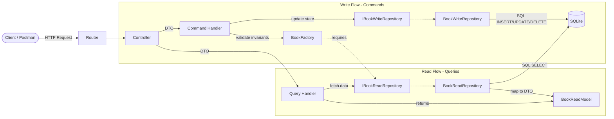

# Lab Work 3

## Topic

CQS (Command-Query Separation) and CQRS pattern.

## Goal

- Separate business logic into Read (Queries) and Write (Commands) operations.
- Introduce `Command Handlers` and `Query Handlers` instead of monolithic `UseCases`.
- Implement separate `WriteRepository` and `ReadRepository` to optimize database interactions.
- Introduce `Data Transfer Objects (DTO)` for queries (Read Models).

## Project Overview

This project builds upon Lab 2 by introducing the CQS architectural pattern. The single `BookUseCases` class and the monolithic `BookRepository` have been split to distinctly handle read and write operations, increasing scalability, testability, and adherence to the Single Responsibility Principle.

## Project Structure

```text
src/
 ├── domain/
 │    ├── models/          # Book.ts, Genre.ts
 │    ├── errors/          # DomainError.ts, NotFoundError.ts
 │    ├── factories/       # BookFactory.ts
 │    └── repositories/    # IBookWriteRepository.ts, IBookReadRepository.ts
 ├── application/
 │    ├── commands/        # Write operations (e.g., CreateBookCommand.ts)
 │    └── queries/         # Read operations (e.g., GetAllBooksQuery.ts)
 ├── infrastructure/
 │    ├── database/        # database.ts
 │    ├── entities/        # book.entity.ts
 │    ├── mappers/         # book.mapper.ts
 │    └── repositories/    # book.repository.ts (BookWriteRepository, BookReadRepository)
 ├── presentation/
 │    └── controllers/     # book.controller.ts (Thin controller calling handlers)
 ├── schemas/              # Zod schemas
 ├── utils/                # catchAsync, errorHandler
 └── server.ts             # Composition root (Dependency Injection setup)
```

## Architecture

The application follows the CQS (Command-Query Separation) principle on top of the Layered Architecture:

### Architecture Diagram (Mermaid)



### Layer Responsibilities

1. **Domain**
   - Contains `Book`, `Genre`, `DomainError`.
   - `BookFactory` validates invariants (uses `IBookReadRepository` to check for duplicates).
   - Interfaces: `IBookWriteRepository`, `IBookReadRepository`.

2. **Application (CQS)**
   - **Commands**: Simple DTOs carrying data for mutations.
   - **Command Handlers**: Execute mutations. Delegate to domain models and write repositories. Do not return domain objects (only `ID` or `void`).
   - **Queries**: Simple DTOs carrying filtering/pagination parameters.
   - **Query Handlers**: Execute reads. Return plain data structures (DTOs/Read Models) instead of domain entities.

3. **Infrastructure**
   - Implements repositories: `BookWriteRepository` and `BookReadRepository`.
   - Uses SQLite (`IDatabase` abstraction).

4. **Presentation**
   - **Thin Controllers**: `BookController` contains zero business logic. It maps HTTP requests to Command/Query DTOs, passes them to Handlers, and sends the result back.

## Data Transfer Objects (DTO) & Read Models

Queries no longer return the `Book` domain entity. Instead, they return a simplified `BookReadModel` (DTO):
```typescript
export type BookReadModel = {
  id: number;
  title: string;
  author: string;
  genre: string;
  rating: number;
  isRead: boolean;
};
```
This reduces the overhead of instantiating heavy domain objects and prevents accidental mutations of domain rules in the view layer.

## API Endpoints

- `GET /books` — Handled by `GetAllBooksQueryHandler`. Returns array of `BookReadModel`.
- `GET /books/:id` — Handled by `GetBookByIdQueryHandler`. Returns `BookReadModel`.
- `GET /books/read` — Handled by `GetReadBooksQueryHandler`. Returns array of `BookReadModel`.
- `POST /books` — Handled by `CreateBookCommandHandler`. Returns `201 Created` with `{ id }`.
- `PATCH /books/:id` — Handled by `UpdateBookCommandHandler`. Returns `204 No Content`.
- `DELETE /books/:id` — Handled by `DeleteBookCommandHandler`. Returns `204 No Content`.
- `PATCH /books/:id/rating` — Handled by `RateBookCommandHandler`. Returns `204 No Content`.
- `PATCH /books/:id/read` — Handled by `MarkAsReadCommandHandler`. Returns `204 No Content`.

## Testing

CQS naturally separates testing strategies:

### Command Testing (Unit Tests)
Located in `tests/application/commands/`.
- Repositories are mocked via `vi.fn()`.
- Tests focus on behavior: "Does it validate rules?", "Does it call save/delete?".
- Extremely fast, no real database involved.

### Query Testing (Integration Tests)
Located in `tests/integration/`.
- Tests focus on results: "Does the endpoint return the correct JSON?".
- Uses a real `:memory:` SQLite database.
- Fully tests the `Controller -> Handler -> Repository -> DB` flow via Supertest.

## Technologies

- Node.js, Express.js, TypeScript
- SQLite (`sqlite` + `sqlite3`)
- Zod for request validation
- Vitest + supertest for testing
